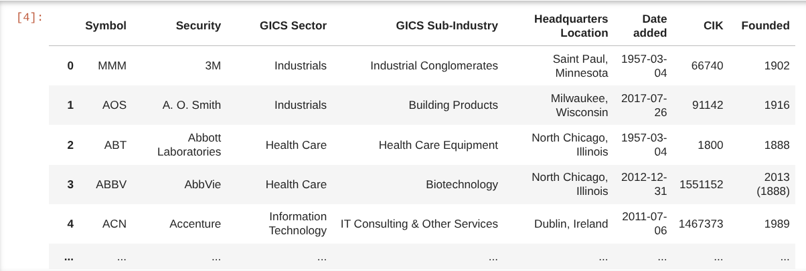
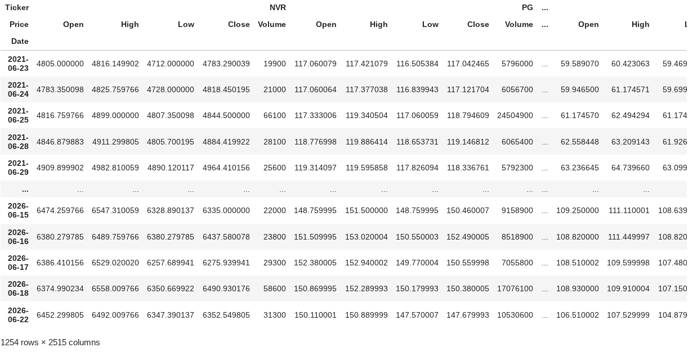
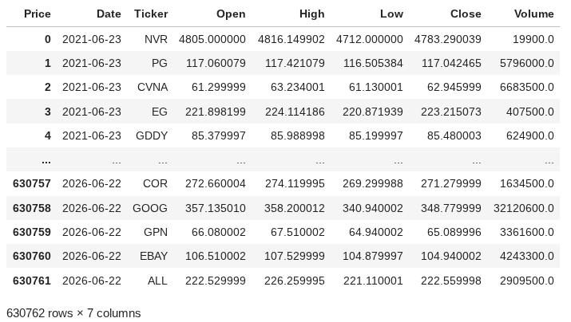
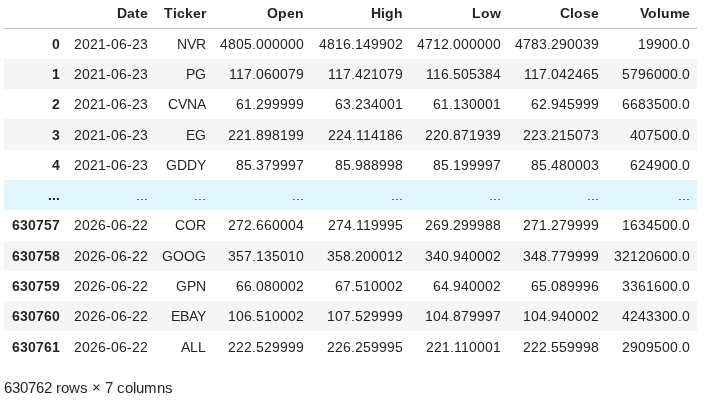

# Structure

Inspiration:

Project Snowflake (Abdirahman): https://github.com/ABDIRAHMAN-I/Project-Snowflake

DataBear stock data article: https://medium.com/@srlk/how-i-built-a-real-time-stock-data-pipeline-from-scratch-with-kafka-airflow-and-snowflake-f473f3f6e6bf

Github: https://github.com/sarach-analytics/stock-market-analytics

Stock-market analytics (Jay): https://github.com/Jay61616/real-time-stocks-mds


## Phase 1: Ingestion + Raw Landing (2–3 weeks)

Type of data: S&P 500 ticker-level OHLCV* data 

*Open, High, Low, Close, Volume data - Standard data for tracking price movement and market activity of an asset

### One-off Historical backfill:

Daily granularity

S&P 500 tickers x 5 years of OHLCV data

1260 trading days x 500 tickers ~1.8M rows (~200MB)

https://pythonfintech.com/articles/how-to-download-market-data-yfinance-python/

https://stackoverflow.com/questions/63107594/how-to-deal-with-multi-level-column-names-downloaded-with-yfinance/63107801#63107801

To get this first import the relevant packages:

```py
import pandas as pd
import lxml
import requests
import yfinance as yf
from io import StringIO
```

To make the requests for all tickers in the S&P500 for the past 5 years, they need to be identified. 

To do this the table listing these on the [Wikipedia site](https://en.wikipedia.org/wiki/List_of_S%26P_500_companies) will be used:

To pull this however, a user-agent (a way of websites identifying the client accessing the browser) is defined too:

```py
url= "https://en.wikipedia.org/wiki/List_of_S%26P_500_companies"
headers= {"User-Agent": "Mozilla/5.0 (Windows NT 10.0; Win64; x64)"}
```

The response is produced and stringIO alongside pd.read_html is used to parse and obtain the first table [0] identified:

```py
response=requests.get(url, headers=headers)

sp500=pd.read_html(StringIO(response.text))[0]
sp500
```


The table contains 503 tickers - this is expected since the S&P500 sometimes has dual-class shares.

String replaced is performed due to yfinance API identifying hyphenated `-` as opposed to dot `.` nomenclature for some companies, so these must be converted:

`sp500['Symbol']=sp500['Symbol'].str.replace(".", "-", regex=False)`

This is explained further in the [appendix section](#brkb-bfb-not-being-recognised) section

Define the ticker symbols to download:

`tickerStrings = sp500['Symbol'].tolist()'

This references the table in the wikipedia page containing the tickers info - saved as a pandas dataframe. The `Symbol` column is referenced from `sp500['Symbol']' and is converted to a list due to the yfinance API only accepting lists for multiple downloads.

Download the OHLCV data using the `yf.download` function and preview the data:

```py
df = yf.download(tickerStrings, group_by='Ticker', period='5y')
df
```


This has row index `Date` and column indexes `Price` and `Ticker`.

The data needs to be one row per ticker per date, in order to identify rows best and store it better.

To do this the `df.stack()` function is used to pivot the ticker information to rows:
```py
df = df.stack(level=0).rename_axis(['Date', 'Ticker']).reset_index()
df
```


The column index `Price` still remains, and is confusing, therefore it needs to be deleted:
```py
df.columns.name = None
df
```


A null-checker/validator is present in the script which checks for null values within the data:

```py
def validate_download(df, expected_tickers, ohlcv_cols=["Open", "High", "Low", "Close", "Volume"]): # (1)!
    
    downloaded_tickers = set(df["Ticker"].unique())
    fully_missing = set(expected_tickers) - downloaded_tickers

    # Per-column null counts per ticker
    null_by_col = (
        df.groupby("Ticker")[ohlcv_cols]
        .apply(lambda x: x.isna().sum())
    )
    
    # Total nulls across all OHLCV columns per ticker
    null_by_col["Total"] = null_by_col.sum(axis=1)
    
    # Only show tickers that have at least one null
    has_nulls = null_by_col[null_by_col["Total"] > 0]
    
    # Distinguish fully null vs partially null
    row_counts = df.groupby("Ticker").size()
    max_possible_nulls = row_counts * len(ohlcv_cols)
    
    fully_null_mask = has_nulls["Total"] == max_possible_nulls[has_nulls.index]
    fully_null = has_nulls[fully_null_mask]
    partially_null = has_nulls[~fully_null_mask]

    # Report
    print(f"Total tickers expected : {len(expected_tickers)}")
    print(f"Total tickers downloaded: {len(downloaded_tickers)}")

    if fully_missing:
        print(f"\nFully missing (not in df at all): {fully_missing}")
    else:
        print("\nFully missing: none")

    if len(fully_null) > 0:
        print(f"\nPresent but completely null (failed download):")
        print(fully_null.to_string())
    else:
        print("\nCompletely null tickers: none")

    if len(partially_null) > 0:
        print(f"\nPartially null (recent IPO/spin-off) — breakdown by column:")
        print(partially_null.to_string())
    else:
        print("\nPartially null tickers: none")

    return fully_missing, fully_null, partially_null
```

1. This is a function which takes the produced Dataframe `df`, the expected tickers from the wikipedia page `expected tickers` and defines the particular OHLCV columns being checked for nulls `ohlcv_cols`

### Forward accumalating data:

Daily granularity

I want to be able to have a warehouse that can store millions of rows of data easily.

Potentially look at intraday for the seperate portfolio drift tracking piece.

Architecture: Medallion architecture [^1]


Data source: yfinance

Suggest Companies House API (UK-relevant, ties into your finance interest) or a free market data API (Alpha Vantage)

Python script to extract data, write to S3 as raw JSON/CSV, partitioned by date (s3://bucket/raw/source=companies_house/year=2026/month=06/day=12/)

Terraform for the S3 bucket, IAM roles/policies (reuse ECS-Forge patterns — least privilege, OIDC for CI)

Containerize the script with Docker

**Deliverable: working extract job, runnable locally and via Docker, with IaC for the storage layer.**

## Phase 2: Loading + Transformation (3–4 weeks)

Load raw S3 data into Snowflake (COPY INTO, or Snowpipe if you want to go further)

Set up dbt project: staging models (1:1 with source, light cleaning) → intermediate → marts (business-level aggregates)

Add dbt tests (uniqueness, not-null, referential integrity)

Document models with dbt docs (auto-generates a docs site — nice parallel to your MkDocs work)

**Deliverable: dbt project with a documented model lineage graph, tests passing in CI.**

## Phase 3: Orchestration (2–3 weeks)

Choose Airflow (more job-market recognition) or Dagster (better DX, growing fast) — Airflow is the safer CV choice given job spec frequency

Build a DAG: extract → load to S3 → Snowflake load → dbt run → dbt test

Run Airflow locally via Docker Compose first; optionally deploy to AWS (MWAA is expensive — a self-hosted ECS deployment is more interesting and reuses ECS-Forge knowledge)

**Deliverable: scheduled, observable pipeline with retry logic and alerting on failure.**

## Phase 4: CI/CD + Quality + Polish (2 weeks)

GitHub Actions: lint Python, run dbt tests, validate Terraform plans

Add data quality monitoring (dbt tests are a start; consider Great Expectations or Soda for a stretch goal)

Architecture diagram (draw.io, as with ECS-Forge)

MkDocs site documenting the pipeline, design decisions, and any "false positive"-style debugging stories — these make great LinkedIn posts

[^1]: https://www.databricks.com/blog/what-is-medallion-architecture

# Appendix

## BRK.B, BF.B not being recognised

When pulling data from yfinance - I get 2 failed downloads:


This happens since Yahoo Finance, which yfinance pulls data from, lists the [Berkshire Hathaway class B stocks](https://uk.finance.yahoo.com/quote/BRK-B/) and [Brown-Forman stocks](https://uk.finance.yahoo.com/quote/BF-B/) tickers with a hyphen "-" instead of a ".", despite other websites doing so.

So in the list, Wikipedia lists these as `BRK.B` and `BF.B` which are not recognised.

To confirm this these get pulled correctly when they are hyphenated:


This was a closed issue in the Github of yfinance: https://github.com/ranaroussi/yfinance/issues/38

These two tickers are the only ones with a `.` :

```py
dotted = sp500.loc[sp500["Symbol"].str.contains(".", regex=False), "Symbol"]
print(dotted.tolist())

['BRK.B', 'BF.B']
```
Therefore the .str.replace() method is called to perform this, with `regex=False` in order to avoid applying RegEx intepretation (since the literal `.` substring must be replaced by `-`):

`sp500['Symbol']=sp500['Symbol'].str.replace(".", "-", regex=False)`

Now to retest the tickers:

```py
dotted = sp500.loc[sp500["Symbol"].str.contains(".", regex=False), "Symbol"]
print(dotted.tolist())

[]
```

This can now be applied to the tickers that you see in the final notebook.

