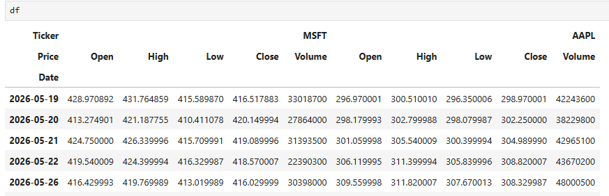
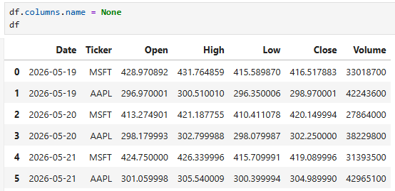
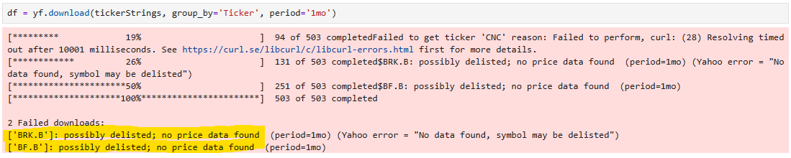
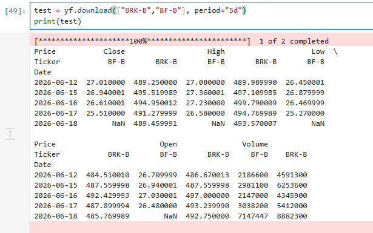

# Structure

Inspiration:

Project Snowflake (Abdirahman): https://github.com/ABDIRAHMAN-I/Project-Snowflake

DataBear stock data article: https://medium.com/@srlk/how-i-built-a-real-time-stock-data-pipeline-from-scratch-with-kafka-airflow-and-snowflake-f473f3f6e6bf

Github: https://github.com/sarach-analytics/stock-market-analytics

Stock-market analytics (Jay): https://github.com/Jay61616/real-time-stocks-mds


## Phase 1: Ingestion + Raw Landing (2–3 weeks)

Type of data: S&P 500 ticker-level OHLCV* data 

*Open, High, Low, Close, Volume data - Standard data for tracking price movement and market activity of an asset

### One-off Historical backfill:

Daily granularity

S&P 500 tickers x 5 years of OHLCV data

1260 trading days x 500 tickers ~1.8M rows (~200MB)

https://pythonfintech.com/articles/how-to-download-market-data-yfinance-python/

https://stackoverflow.com/questions/63107594/how-to-deal-with-multi-level-column-names-downloaded-with-yfinance/63107801#63107801

To get this first import the `yfinance` package:

`import yfinance as yf`

Define the ticker symbols to download:

`tickerStrings = ['AAPL', 'MSFT']`

!!! info

    Full list is in the `Data_import` Jupyter notebook

Download the OHLCV data using the `yf.download` function and preview the data:

```py
df = yf.download(tickerStrings, group_by='Ticker', period='1mo')
```
This has row index `Date` and column indexes `Price` and `Ticker`.

The data needs to be one row per ticker per date, in order to identify rows best and store it better.

To do this the `df.stack()` function is used to pivot the ticker information to rows:



The column index `Price` still remains, and is confusing, therefore it needs to be deleted:




### Forward accumalating data:

Daily granularity

I want to be able to have a warehouse that can store millions of rows of data easily.

Potentially look at intraday for the seperate portfolio drift tracking piece.

Architecture: Medallion architecture [^1]


Data source: yfinance

Suggest Companies House API (UK-relevant, ties into your finance interest) or a free market data API (Alpha Vantage)

Python script to extract data, write to S3 as raw JSON/CSV, partitioned by date (s3://bucket/raw/source=companies_house/year=2026/month=06/day=12/)

Terraform for the S3 bucket, IAM roles/policies (reuse ECS-Forge patterns — least privilege, OIDC for CI)

Containerize the script with Docker

**Deliverable: working extract job, runnable locally and via Docker, with IaC for the storage layer.**

## Phase 2: Loading + Transformation (3–4 weeks)

Load raw S3 data into Snowflake (COPY INTO, or Snowpipe if you want to go further)

Set up dbt project: staging models (1:1 with source, light cleaning) → intermediate → marts (business-level aggregates)

Add dbt tests (uniqueness, not-null, referential integrity)

Document models with dbt docs (auto-generates a docs site — nice parallel to your MkDocs work)

**Deliverable: dbt project with a documented model lineage graph, tests passing in CI.**

## Phase 3: Orchestration (2–3 weeks)

Choose Airflow (more job-market recognition) or Dagster (better DX, growing fast) — Airflow is the safer CV choice given job spec frequency

Build a DAG: extract → load to S3 → Snowflake load → dbt run → dbt test

Run Airflow locally via Docker Compose first; optionally deploy to AWS (MWAA is expensive — a self-hosted ECS deployment is more interesting and reuses ECS-Forge knowledge)

**Deliverable: scheduled, observable pipeline with retry logic and alerting on failure.**

## Phase 4: CI/CD + Quality + Polish (2 weeks)

GitHub Actions: lint Python, run dbt tests, validate Terraform plans

Add data quality monitoring (dbt tests are a start; consider Great Expectations or Soda for a stretch goal)

Architecture diagram (draw.io, as with ECS-Forge)

MkDocs site documenting the pipeline, design decisions, and any "false positive"-style debugging stories — these make great LinkedIn posts

[^1]: https://www.databricks.com/blog/what-is-medallion-architecture

# Appendix

## BRK.B, BF.B not being recognised

When pulling data from yfinance - I get 2 failed downloads:



This happens since Yahoo Finance, which yfinance pulls data from, lists the [Berkshire Hathaway class B stocks](https://uk.finance.yahoo.com/quote/BRK-B/) and [Brown-Forman stocks](https://uk.finance.yahoo.com/quote/BF-B/) tickers with a hyphen "-" instead of a ".", despite other websites doing so.

So in the list, Wikipedia lists these as `BRK.B` and `BF.B` which are not recognised.

To confirm this these get pulled correctly when they are hyphenated:



This was a closed issue in the Github of yfinance: https://github.com/ranaroussi/yfinance/issues/38

These two tickers are the only ones with a `.` :

```py
dotted = sp500.loc[sp500["Symbol"].str.contains(".", regex=False), "Symbol"]
print(dotted.tolist())

['BRK.B', 'BF.B']
```
Therefore the .str.replace() method is called to perform this, with `regex=False` in order to avoid applying RegEx intepretation (since the literal `.` substring must be replaced by `-`):

`sp500['Symbol']=sp500['Symbol'].str.replace(".", "-", regex=False)`

Now to retest the tickers:

```py
dotted = sp500.loc[sp500["Symbol"].str.contains(".", regex=False), "Symbol"]
print(dotted.tolist())

[]
```

This can now be applied to the tickers that you see in the final notebook.

