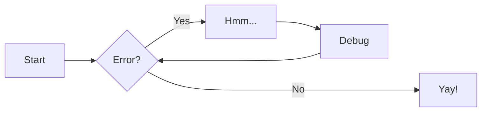

# Time-series Notes

## Intro

Time series is a dataset where the elements follow a sequential order due to a time variable.

Predicting future values of a time series is called forecasting.

Trends and patterns may be seasonal or cyclical.

Example:

<div style="text-align: center;">
  
</div>

## Uses and types

The uses for Time-Series analysis are:

1. Forecasting
2. Anomaly detection


>Time series typically involve stochastic processes i.e., processes that evolve over time in a random and unpredictable manner.

When modelling time series data the data falls into two categories:

- **Signals:** Trends, seasonality, and cycles

- **Noise/Residuals:** Other data which may/may not be random

https://www.geeksforgeeks.org/machine-learning/time-series-analysis-and-forecasting/

There are various types of time-series forecasting methods:

- **Univariate:** Only tracks one variable with respect to time
- **Multivariate:** Tracks several related variables and understand how they effect each other over time

- **Continous:** Observations are at every moment at a very high frequency, i.e., ECG data
- **Discrete:** Observations that are at set intervals i.e., hourly, daily etc.

- **Stationary:** Series which has a constant mean, variance, and pattern, with no trend or seasonality
- **Non-stationary:** Series where the above changes

## Data Analytics Lifecycle

3. **Model Planning:** Study relationships between the important measures, and determine the best model
4. **Model Building:** Develop datasets to test and train models, and execute these models
5. **Communicate Results:** Communicate the findings, and quantify the business value


### Discovery

Frame initial business problem and make initial hypothesis.

1. **Assess the resources available to the project:** People, technology, time, and data
2. **Learning the business domain:** This includes the history (Have similar projects been attempted before at the org?)
3. **Frame the problem and formulate hypothesis:** This will be tested using the data

### Data Preparation

Familiarise yourself with the data, transform, and clean data.

#### Graphs and notation

Best way to make sense of time-series data is by plotting it.

When forecasting: It is important data is in order chronologically (by time) and evenly spaced out. One important assumption for forecasting to work is that datapoints have some dependency to each other.

When doing forecasting - the independent time variable is the index, and is on the x-axis.

The dependent variable being looked at, y is on the y-axis. The subscript t is added to this to refer to the value of the dependent variable at a particular moment in time.

Time-series data can be plotted in pandas.

#### Datetime index

For pandas to recognise Time Series data - the index of the pandas `dataframe` needs to be a `datetime` object. To convert this:

First import relevant libraries:

```python
import pandas as pd
import matplotlib as plt
```

Then import the data:

```python
df = pd.read_csv("Electric_Production.csv")

print(df.head().to_markdown(index=True))
```

|    | DATE     |   IPG2211A2N |
|---:|:---------|-------------:|
|  0 | 1/1/1985 |      72.5052 |
|  1 | 2/1/1985 |      70.672  |
|  2 | 3/1/1985 |      62.4502 |
|  3 | 4/1/1985 |      57.4714 |
|  4 | 5/1/1985 |      55.3151 |

Rename columns and check the existing datatype:

```
df = df.rename(columns={
    "DATE": "Date",
    "IPG2211A2N": "Value"
})
```

```python
df.dtypes
```

```
Date         str
Value    float64
dtype: object
```

The Date is recognised as a string data-type and not time-series, it therefore needs to be converted:

```python
df["Date"] = pd.to_datetime(df["Date"])
print(df.head().to_markdown(index=True))
```

|    | Date                |   Price |
|---:|:--------------------|--------:|
|  0 | 2019-08-24 00:00:00 |      40 |
|  1 | 2019-08-25 00:00:00 |      42 |
|  2 | 2019-08-26 00:00:00 |      37 |
|  3 | 2019-08-27 00:00:00 |      38 |
|  4 | 2019-08-28 00:00:00 |      41 |

```python
df.dtypes
```
```
Date     datetime64[us]
Price             int64
dtype: object
```

The time is in the correct format, and it can now be converted into the index:

```python
df.set_index("Date", inplace= True)
print(df.head().to_markdown(index=True))
```

| Date                |   Price |
|:--------------------|--------:|
| 2019-08-24 00:00:00 |      40 |
| 2019-08-25 00:00:00 |      42 |
| 2019-08-26 00:00:00 |      37 |
| 2019-08-27 00:00:00 |      38 |
| 2019-08-28 00:00:00 |      41 |

The Date is now the index - and pandas can now perform time-series analysis.

Indexing via Time Series in pandas offers several advantages- and is worth it.

#### Plotting, slicing, resampling time-series

See jupyter notebook.

#### Handling outliers


#### Missing values

When you have time-series data in python, the indices are set to datetime format. These can be unevenly spaced.

This means if there are missing observations from the index python won't notice them using typical methods such as .isna().sum() and .info(), so you can't rely on null counts for data.


To get a view of the data in order - perform a `.sort_index` method on the Dataframe with `ascending=True` argument.

`df=df.sort_index(ascending=True)`

`df.head()`

| date                |   temperature |
|:--------------------|--------------:|
| 1966-01-01 00:00:00 |          18.1 |
| 1966-01-02 00:00:00 |          20.5 |
| 1966-01-03 00:00:00 |          20.3 |
| 1966-01-04 00:00:00 |          20.3 |
| 1966-01-05 00:00:00 |          20.6 |


Taking a look at nulls:

```py
df.info()
<class 'pandas.DataFrame'>
DatetimeIndex: 19710 entries, 1966-01-01 to 2019-12-31
Data columns (total 1 columns):
 #   Column       Non-Null Count  Dtype  
---  ------       --------------  -----  
 0   temperature  19710 non-null  float64
dtypes: float64(1)
memory usage: 308.0 KB
```

There do not appear to be nulls present, however there may be null values where the index is missing i.e., you are looking at daily data and one of the days is missing.

To identify these, convert the time-series frequency to daily using the `.asfreq()` method

This will ensure the time series for the data range has every day contained, surfacing the nulls:

```
auckland = auckland.asfreq('D')

D for daily, if monthly use ME

Checking again for missing values:

```py
auckland.info()
<class 'pandas.DataFrame'>
DatetimeIndex: 19723 entries, 1966-01-01 to 2019-12-31
Freq: D
Data columns (total 1 columns):
 #   Column       Non-Null Count  Dtype  
---  ------       --------------  -----  
 0   temperature  19710 non-null  float64
dtypes: float64(1)
memory usage: 308.2 KB
```

There are now 19823 rows, with 19710 non-nulls, resulting in 13 null-values

To find where these are use the `.isna()` method:

```py
auckland[auckland['temperature'].isna()]
```

| date                |   temperature |
|:--------------------|--------------:|
| 1966-09-13 00:00:00 |           nan |
| 1969-02-27 00:00:00 |           nan |
| 1971-04-11 00:00:00 |           nan |
| 1974-04-12 00:00:00 |           nan |
| 1974-05-07 00:00:00 |           nan |
| 1974-10-25 00:00:00 |           nan |
| 1977-07-02 00:00:00 |           nan |
| 1980-02-23 00:00:00 |           nan |
| 1981-03-04 00:00:00 |           nan |
| 1987-02-19 00:00:00 |           nan |
| 1992-11-12 00:00:00 |           nan |
| 1995-04-06 00:00:00 |           nan |
| 1995-07-31 00:00:00 |           nan |

To fix these values, you can use the fillna() function to perform this - with options:

- Forward-fill: Fills missing values with the previous value - `ffill()`
- Backward-fill: Fills missing values with the next value
- Interpolation: Fills missing values with an estimate based on the available data

In this case forward-fill is used:

`auckland=auckland.ffill()`

```py
md(auckland.loc[['1966-09-13', '1969-02-27', '1971-04-11', '1974-04-12', 
        '1974-05-07', '1974-10-25', '1977-07-02', '1980-02-23',
        '1981-03-04', '1987-02-19', '1992-11-12', '1995-04-06', 
        '1995-07-31']])
```

| date                |   temperature |
|:--------------------|--------------:|
| 1966-09-13 00:00:00 |           8.6 |
| 1969-02-27 00:00:00 |          18.6 |
| 1971-04-11 00:00:00 |          17.7 |
| 1974-04-12 00:00:00 |          15.4 |
| 1974-05-07 00:00:00 |          12.4 |
| 1974-10-25 00:00:00 |          13.3 |
| 1977-07-02 00:00:00 |          13.3 |
| 1980-02-23 00:00:00 |          20.8 |
| 1981-03-04 00:00:00 |          22.6 |
| 1987-02-19 00:00:00 |          17.2 |
| 1992-11-12 00:00:00 |          17   |
| 1995-04-06 00:00:00 |          21.2 |
| 1995-07-31 00:00:00 |           8.7 |

These are all filled in.

Checking the null count:

```py
auckland.info()
<class 'pandas.DataFrame'>
DatetimeIndex: 19723 entries, 1966-01-01 to 2019-12-31
Freq: D
Data columns (total 1 columns):
 #   Column       Non-Null Count  Dtype  
---  ------       --------------  -----  
 0   temperature  19723 non-null  float64
dtypes: float64(1)
memory usage: 824.2 KB
```

The entries are same as the non-null count, therefore there are no nulls present.

### Model Planning

This phase involves determining the methods, techniques, and workflows needed for Model building.

One important component of this where the time series data is broken down is called Decomposition.

#### Decomposition

Time-series can be decomposed into:

- Level: The average value of the series - i.e.,  the baseline in absence of patterns
- Signal: The true underlying process that generated the data, consists of Trend and seasonality
- Noise: Variability in data due to randomness

##### Signal

There are two types:

- Trend: Increasing or decreasing behaviour of a series over time can be linear, exponential or quadratic
- Seasonality: Represents repeating cycles that have similar time intervals

##### Noise

After trend and seasonality, what variation would be left? These residuals are known as noise.

##### Cycle

Another recurring pattern in data similar to season, but has varying lengths - typically due to business cycles and economic conditions.

##### Additive and Multiplicative

The way the above components interact with each other, can either be additive or multiplicative.

- Multiplicative: As the level of the time series increases, the value and size of seasonal and residual fluctuations varies.

- Additive: As the level of the time series increases, the value and size of seasonal and residual fluctuations remain the same.

## Examples

### Admonitions

> Go to [documentation](https://zensical.org/docs/authoring/admonitions/)

!!! note

    This is a **note** admonition. Use it to provide helpful information.

!!! warning

    This is a **warning** admonition. Be careful!

### Details

> Go to [documentation](https://zensical.org/docs/authoring/admonitions/#collapsible-blocks)

??? info "Click to expand for more info"

    This content is hidden until you click to expand it.
    Great for FAQs or long explanations.

## Code Blocks

> Go to [documentation](https://zensical.org/docs/authoring/code-blocks/)

``` python hl_lines="2" title="Code blocks"
def greet(name):
    print(f"Hello, {name}!") # (1)!

greet("Python")
```

1.  > Go to [documentation](https://zensical.org/docs/authoring/code-blocks/#code-annotations)

    Code annotations allow to attach notes to lines of code.

Code can also be highlighted inline: `#!python print("Hello, Python!")`.

## Content tabs

> Go to [documentation](https://zensical.org/docs/authoring/content-tabs/)

=== "Python"

    ``` python
    print("Hello from Python!")
    ```

=== "Rust"

    ``` rs
    println!("Hello from Rust!");
    ```

## Diagrams

> Go to [documentation](https://zensical.org/docs/authoring/diagrams/)



## Footnotes

> Go to [documentation](https://zensical.org/docs/authoring/footnotes/)

Here's a sentence with a footnote.[^1]

Hover it, to see a tooltip.

[^1]: This is the footnote.


## Formatting

> Go to [documentation](https://zensical.org/docs/authoring/formatting/)

- ==This was marked (highlight)==
- ^^This was inserted (underline)^^
- ~~This was deleted (strikethrough)~~
- H~2~O
- A^T^A
- ++ctrl+alt+del++

## Icons, Emojis

> Go to [documentation](https://zensical.org/docs/authoring/icons-emojis/)

* :sparkles: `:sparkles:`
* :rocket: `:rocket:`
* :tada: `:tada:`
* :memo: `:memo:`
* :eyes: `:eyes:`

## Maths

> Go to [documentation](https://zensical.org/docs/authoring/math/)

$$
\cos x=\sum_{k=0}^{\infty}\frac{(-1)^k}{(2k)!}x^{2k}
$$

!!! warning "Needs configuration"
    Note that MathJax is included via a `script` tag on this page and is not
    configured in the generated default configuration to avoid including it
    in a pages that do not need it. See the documentation for details on how
    to configure it on all your pages if they are more Maths-heavy than these
    simple starter pages.

<script id="MathJax-script" src="https://unpkg.com/mathjax@3/es5/tex-mml-chtml.js"></script>
<script>
  window.MathJax = {
    tex: {
      inlineMath: [["\\(", "\\)"]],
      displayMath: [["\\[", "\\]"]],
      processEscapes: true,
      processEnvironments: true
    },
    options: {
      ignoreHtmlClass: ".*|",
      processHtmlClass: "arithmatex"
    }
  };

  document$.subscribe(() => {
    MathJax.startup.output.clearCache()
    MathJax.typesetClear()
    MathJax.texReset()
    MathJax.typesetPromise()
  })
</script>

## Task Lists

> Go to [documentation](https://zensical.org/docs/authoring/lists/#using-task-lists)

* [x] Install Zensical
* [x] Configure `zensical.toml`
* [x] Write amazing documentation
* [ ] Deploy anywhere

## Tooltips

> Go to [documentation](https://zensical.org/docs/authoring/tooltips/)

[Hover me][example]

  [example]: https://example.com "I'm a tooltip!"
