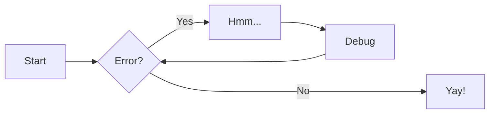

# Time-series Notes

## Intro

Time series is a dataset where the elements follow a sequential order due to a time variable.

Predicting future values of a time series is called forecasting.

Trends and patterns may be seasonal or cyclical.

Example:

<div style="text-align: center;">
  
</div>

## Uses and types

The uses for Time-Series analysis are:

1. Forecasting
2. Anomaly detection


>Time series typically involve stochastic processes i.e., processes that evolve over time in a random and unpredictable manner.

When modelling time series data the data falls into two categories:

- **Signals:** Trends, seasonality, and cycles

- **Noise/Residuals:** Other data which may/may not be random

https://www.geeksforgeeks.org/machine-learning/time-series-analysis-and-forecasting/

There are various types of time-series forecasting methods:

- **Univariate:** Only tracks one variable with respect to time
- **Multivariate:** Tracks several related variables and understand how they effect each other over time

- **Continous:** Observations are at every moment at a very high frequency, i.e., ECG data
- **Discrete:** Observations that are at set intervals i.e., hourly, daily etc.

- **Stationary:** Series which has a constant mean, variance, and pattern, with no trend or seasonality
- **Non-stationary:** Series where the above changes

## Data Analytics Lifecycle

3. **Model Planning:** Study relationships between the important measures, and determine the best model
4. **Model Building:** Develop datasets to test and train models, and execute these models
5. **Communicate Results:** Communicate the findings, and quantify the business value


### Discovery

Frame initial business problem and make initial hypothesis.

1. **Assess the resources available to the project:** People, technology, time, and data
2. **Learning the business domain:** This includes the history (Have similar projects been attempted before at the org?)
3. **Frame the problem and formulate hypothesis:** This will be tested using the data

### Data Preparation

Familiarise yourself with the data, transform, and clean data.

#### Graphs and notation

Best way to make sense of time-series data is by plotting it.

When forecasting: It is important data is in order chronologically (by time) and evenly spaced out. One important assumption for forecasting to work is that datapoints have some dependency to each other.

When doing forecasting - the independent time variable is the index, and is on the x-axis.

The dependent variable being looked at, y is on the y-axis. The subscript t is added to this to refer to the value of the dependent variable at a particular moment in time.

Time-series data can be plotted in pandas.

#### Datetime index

For pandas to recognise Time Series data - the index of the pandas `dataframe` needs to be a `datetime` object. To convert this:

First import relevant libraries:

```python
import pandas as pd
import matplotlib as plt
```

Then import the data:

```python
df = pd.read_csv("Electric_Production.csv")

print(df.head().to_markdown(index=True))
```

|    | DATE     |   IPG2211A2N |
|---:|:---------|-------------:|
|  0 | 1/1/1985 |      72.5052 |
|  1 | 2/1/1985 |      70.672  |
|  2 | 3/1/1985 |      62.4502 |
|  3 | 4/1/1985 |      57.4714 |
|  4 | 5/1/1985 |      55.3151 |

Rename columns and check the existing datatype:

```
df = df.rename(columns={
    "DATE": "Date",
    "IPG2211A2N": "Value"
})
```

```python
df.dtypes
```

```
Date         str
Value    float64
dtype: object
```

The Date is recognised as a string data-type and not time-series, it therefore needs to be converted:

```python
df["Date"] = pd.to_datetime(df["Date"])
print(df.head().to_markdown(index=True))
```

|    | Date                |   Price |
|---:|:--------------------|--------:|
|  0 | 2019-08-24 00:00:00 |      40 |
|  1 | 2019-08-25 00:00:00 |      42 |
|  2 | 2019-08-26 00:00:00 |      37 |
|  3 | 2019-08-27 00:00:00 |      38 |
|  4 | 2019-08-28 00:00:00 |      41 |

```python
df.dtypes
```
```
Date     datetime64[us]
Price             int64
dtype: object
```

The time is in the correct format, and it can now be converted into the index:

```python
df.set_index("Date", inplace= True)
print(df.head().to_markdown(index=True))
```

| Date                |   Price |
|:--------------------|--------:|
| 2019-08-24 00:00:00 |      40 |
| 2019-08-25 00:00:00 |      42 |
| 2019-08-26 00:00:00 |      37 |
| 2019-08-27 00:00:00 |      38 |
| 2019-08-28 00:00:00 |      41 |

The Date is now the index - and pandas can now perform time-series analysis.

Indexing via Time Series in pandas offers several advantages- and is worth it.

#### Plotting, slicing, resampling time-series

#### Handling outliers and missing values


## Examples

### Admonitions

> Go to [documentation](https://zensical.org/docs/authoring/admonitions/)

!!! note

    This is a **note** admonition. Use it to provide helpful information.

!!! warning

    This is a **warning** admonition. Be careful!

### Details

> Go to [documentation](https://zensical.org/docs/authoring/admonitions/#collapsible-blocks)

??? info "Click to expand for more info"

    This content is hidden until you click to expand it.
    Great for FAQs or long explanations.

## Code Blocks

> Go to [documentation](https://zensical.org/docs/authoring/code-blocks/)

``` python hl_lines="2" title="Code blocks"
def greet(name):
    print(f"Hello, {name}!") # (1)!

greet("Python")
```

1.  > Go to [documentation](https://zensical.org/docs/authoring/code-blocks/#code-annotations)

    Code annotations allow to attach notes to lines of code.

Code can also be highlighted inline: `#!python print("Hello, Python!")`.

## Content tabs

> Go to [documentation](https://zensical.org/docs/authoring/content-tabs/)

=== "Python"

    ``` python
    print("Hello from Python!")
    ```

=== "Rust"

    ``` rs
    println!("Hello from Rust!");
    ```

## Diagrams

> Go to [documentation](https://zensical.org/docs/authoring/diagrams/)



## Footnotes

> Go to [documentation](https://zensical.org/docs/authoring/footnotes/)

Here's a sentence with a footnote.[^1]

Hover it, to see a tooltip.

[^1]: This is the footnote.


## Formatting

> Go to [documentation](https://zensical.org/docs/authoring/formatting/)

- ==This was marked (highlight)==
- ^^This was inserted (underline)^^
- ~~This was deleted (strikethrough)~~
- H~2~O
- A^T^A
- ++ctrl+alt+del++

## Icons, Emojis

> Go to [documentation](https://zensical.org/docs/authoring/icons-emojis/)

* :sparkles: `:sparkles:`
* :rocket: `:rocket:`
* :tada: `:tada:`
* :memo: `:memo:`
* :eyes: `:eyes:`

## Maths

> Go to [documentation](https://zensical.org/docs/authoring/math/)

$$
\cos x=\sum_{k=0}^{\infty}\frac{(-1)^k}{(2k)!}x^{2k}
$$

!!! warning "Needs configuration"
    Note that MathJax is included via a `script` tag on this page and is not
    configured in the generated default configuration to avoid including it
    in a pages that do not need it. See the documentation for details on how
    to configure it on all your pages if they are more Maths-heavy than these
    simple starter pages.

<script id="MathJax-script" src="https://unpkg.com/mathjax@3/es5/tex-mml-chtml.js"></script>
<script>
  window.MathJax = {
    tex: {
      inlineMath: [["\\(", "\\)"]],
      displayMath: [["\\[", "\\]"]],
      processEscapes: true,
      processEnvironments: true
    },
    options: {
      ignoreHtmlClass: ".*|",
      processHtmlClass: "arithmatex"
    }
  };

  document$.subscribe(() => {
    MathJax.startup.output.clearCache()
    MathJax.typesetClear()
    MathJax.texReset()
    MathJax.typesetPromise()
  })
</script>

## Task Lists

> Go to [documentation](https://zensical.org/docs/authoring/lists/#using-task-lists)

* [x] Install Zensical
* [x] Configure `zensical.toml`
* [x] Write amazing documentation
* [ ] Deploy anywhere

## Tooltips

> Go to [documentation](https://zensical.org/docs/authoring/tooltips/)

[Hover me][example]

  [example]: https://example.com "I'm a tooltip!"
